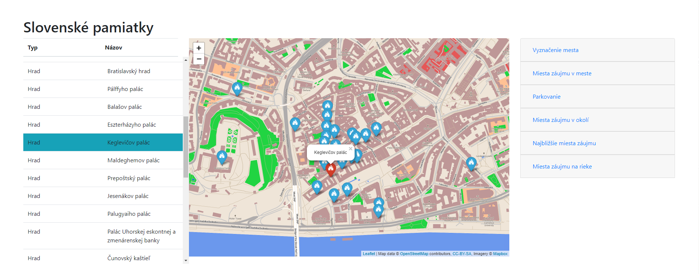

# Prehľad
**Jakub Kazimír**

Táto aplikácia zobrazuje historické pamiatky na Slovensku a okolitých malých častiach susedných štátov. Hlavné možnosti aplikácie:
- Vyhľadávanie vybraných historických pamiatok
  - na základe zvoleného mesta
  - na základe zvolenej polohy a okruhu
  - najbližšie pamiatky od mojej polohy
- Vyhľadávanie zaujímavých miest na riekach
- Vyhľadanie nabližších parkovacích miest v okolí zvolenej pamiatky
- Každá pamiatka má svoje špecifické označenie
- Zoradzovanie výsledkov v tabuľke pomocou najbližších výsledkov
- Interaktívna tabuľka s aktívnym zobrazaovaním práve zvolenej pamiatky
- Zobrazenie názvov vybraných objektov na mape

Takto vyzerá aplikácia s vyhľadanými pamiatkami:



Aplikácia je zložená z FE, ktorý je vytvorený pomocou knižnice [Leaflet](https://leafletjs.com/) pre hlavný mapový komponent a [Pug.js](https://pugjs.org) pre vytvorenie HTML stránky. Backend je vytvorený vo frameworku [Express.js](https://expressjs.com/), ktorý beží na [Node.js](https://nodejs.org/en/). Tento framework sa pripája na [PostGIS](https://postgis.net/) databázu, v ktorej sú uložené všetky dáta. Keďže [Express.js](https://expressjs.com/) je serverový framework, všetko potrebné je vykonané na serveri, ktorý na FE odošle plnú HTML stránku so všetkými údajmi.

# Frontend

Aplikácia je vytvorená pomocou šablónového frameworku [Pug.js](https://pugjs.org), ktorý sme rozšírili o Bootstrap, jQuery a [Leaflet.awesome-markers](https://github.com/lvoogdt/Leaflet.awesome-markers), čo je opensource knižnica pre používanie vlastných ikon ako označovačov na mape. Táto knižnica bola upravená pre použitie špeciálnych ikon - [Font Awesome](https://fontawesome.com/). Taktiež sme vytvorili vlastné validácie a interakcie medzi tabuľkou a mapou, pre lepší zážitok z používania aplikácie. Pre zobrazenie geografických dát sme použili knižnicu [Leaflet](https://leafletjs.com/), spolu s nami vytvoreným mapovým podkladom na [MapBox](https://mapbox.com).

Mapový podklad bol zmenený pomocou farieb pozadia, budov, riek a iných objektov. Taktiež bol zmenený štýl písma a boli pridané nové ikony pre body záujmu, ktoré sa líšia na základe typu pamiatky.

Šablóna HTML kódu sa nachádza v [map.pug](views/map.pug), kde sú aj všetky javascripty starajúce sa o interakcie tabuľky a mapy.

# Backend

Backend je vytvorený vo frameworku [Express.js](https://expressjs.com/), ktorý beží na [Node.js](https://nodejs.org/en/). Stará sa o spracovávanie requestov z FE, pripojenie k databáze, spracovanie výsledkov z databázy a ich odoslanie na FE.

Hlavný súbor, ktorý vykonáva tieto operácie [index.js](routes/index.js).

## Dáta

Dáta boli stiahnuté z [Open Street Maps](https://www.openstreetmap.org/) a zahŕňajú celé Slovensko, spolu s okolitým hraničnými oblasťami. Celkovo bolo stiahnutých 7 súborov z oblasťami Slovenska, ktoré boli následne spojené dohromady pomocou [Osmium Tool](https://osmcode.org/osmium-tool/). Dáta dohromady majú približnú veľkosť 7.1GB. Tieto dáta boli následne spracované pomocou nástroja [osm2pgsql](https://wiki.openstreetmap.org/wiki/Osm2pgsql).

Pre databázu som použil [Docker](https://www.docker.com/) obraz [starefossen/pgrouting](https://hub.docker.com/r/starefossen/pgrouting/builds/). Obsahuje okrem Postgres a PostGIS databázy aj nástroj pgAdmin4 a pgRouting.

### Databáza

Dáta boli po importe nasledovne upravené:
- stĺpec osm_id bol premenovaný na id
- bol vytvorený stĺpec geom, do ktorého boli prekonvertované údaje zo stĺpca way pomocou `ST_Transform(way, 4326);`
- boli vytvorené indexy pre všetky tabuľky na daný stĺpec geom
- bol vytvorený index pre tabuľku `planet_osm_polygon` za použitia `ST_Centroid(geom)`, pre rýchlejšie spracovávanie dát
- boli vytvorené indexy pre tabuľku `planet_osm_polygon` na stĺpce `id`, `name`, `historic`, ktoré sú často používané v dopytoch
- bol vytvorený index pre tabuľku `planet_osm_line` na stĺpec `name`
- bol vytvorený index pre tabuľku `planet_osm_point` na stĺpec `amenity`

Ukážka dopytu na databázu pre hľadanie zaujímavosti na rieke:
```
    SELECT  distinct(place.id), 
            place.name as name, 
            ST_Centroid(place.geom) as geom,
            ST_X(ST_Centroid(place.geom)) as cent_long,
            ST_Y(ST_Centroid(place.geom)) as cent_lat,
            CASE 
                WHEN place.water IS NOT NULL THEN
                    place.water
                WHEN place.man_made IS NOT NULL THEN
                    place.man_made 
            END as type
       FROM planet_osm_polygon AS place
       JOIN planet_osm_line AS river ON (ST_Crosses(place.geom,river.geom))
      WHERE river.name = 'Dunaj'
		    AND river.waterway = 'river'
        AND place.admin_level is null
        AND place.boundary is null
        AND (place.natural = 'water' OR place.man_made = 'bridge')
        AND (place.water <> 'river' OR place.water IS null)
        AND place.name IS NOT NULL
```

Ukážka dopytu na databázu pre hľadanie zaujímavosti v meste:
```
    SELECT  distinct(place.id), 
            place.name as name, 
            ST_Centroid(place.geom) as geom,
            ST_X(ST_Centroid(place.geom)) as cent_long,
            ST_Y(ST_Centroid(place.geom)) as cent_lat,
            place.historic as type
       FROM planet_osm_polygon AS city, 
            planet_osm_polygon AS place
      WHERE ST_Intersects(city.geom,place.geom)
        AND ST_Area(ST_Intersection(city.geom,place.geom)) != ST_Area(city.geom)
        AND place.name IS NOT NULL
        AND city.name = 'Bratislava'
        AND place.historic IN ('castle')
```

Ukážka dopytu na databázu pre hľadanie zaujímavosti v okolí:
```
    SELECT  distinct(lg.id), 
            lg.name,
            ST_Centroid(lg.geom) as geom,
            ST_X(ST_Centroid(lg.geom)) as cent_long,
            ST_Y(ST_Centroid(lg.geom)) as cent_lat,
            lg.historic as type,
            ST_Distance(lg.geom, ST_MakePoint($1,$2)::geography) as distance
       FROM planet_osm_polygon as lg
      WHERE ST_DWithin(lg.geom, ST_MakePoint(17,46)::geography, 1000)
        AND lg.admin_level is null
        AND lg.boundary is null
        AND lg.place is null
        AND lg.historic IN ('castle')
        AND lg.name IS NOT NULL
      ORDER BY distance
```

Ukážka dopytu na databázu pre hľadanie parkovania pri pamiatke:
```
    SELECT distinct(parking.id),
           parking.name,
           parking.geom,
           ST_X(ST_Centroid(parking.geom)) as cent_long,
           ST_Y(ST_Centroid(parking.geom)) as cent_lat,
           'parking' as type,
           st_distance(ST_Centroid(place.geom), parking.geom) as dist
      FROM planet_osm_polygon place,
           planet_osm_point parking
     WHERE place.id = $1
       AND parking.amenity = 'parking'
     ORDER BY st_distance(ST_Centroid(place.geom), parking.geom)
     LIMIT 10
```

Ukážka dopytu na databázu pre hľadanie najbližších zaujímavostí:
```
    SELECT distinct(lg.id),
           lg.name,
           ST_Centroid(lg.geom) as geom,
           st_distance(lg.geom, ST_MakePoint(17,47)::geography) as distance,
           ST_X(ST_Centroid(lg.geom)) as cent_long,
           ST_Y(ST_Centroid(lg.geom)) as cent_lat,
           lg.historic as type
      FROM planet_osm_polygon lg
     WHERE lg.admin_level is null
       AND lg.boundary is null
       AND lg.place is null
       AND lg.historic IN ('castle')
       AND lg.name IS NOT NULL
     ORDER BY distance 
     LIMIT 20
```

Všetky requesty boli ešte obalené vo formáte, ktorý vytváral GeoJSON pre použitú knižnicu [Leaflet](https://leafletjs.com/). Taktiež boli všetky dopyty vyskladávané pomocou knižnice [Node Postgres](https://node-postgres.com/).

Všetky tieto dopyty sa nachádzajú v súbore [index.js](routes/index.js).

Z PostGIS funkcií som použil:
  - **ST_Centroid**
  - **ST_Crosses**
  - **ST_Intersects**
  - **ST_Intersection**
  - **ST_Area**
  - **ST_DWithin**
  - **ST_Distance**

Taktiež som použil tieto pomocné funkcie:
  - **ST_X**
  - **ST_Y**
  - **ST_MakePoint**

## Api

**Zobrazenie mesta**

`GET /filter?city=Bratislava`

**Zobrazenie vybraných pamiatok vo vybranom meste**

`GET /show?city=Bratislava&type=castle&type=monastery&type=theatre`

**Zobrazenie parkovacích miest v blízkosti pamiatky**

`GET /parking?id=-595748`

**Zobrazenie vybraných miest záujmu na základe polohy a okruhu**

`GET /around?distance=1000&lat=48.14133451830995&long=17.111997557971296&type=castle&type=monastery`

**Zobrazenie najbližších vybraných miest záujmu na základe polohy**

`GET /near?lat=48.14426974867694&long=17.110219001770023&type=castle&type=theatre`

**Zobrazenie vybraných miest záujmu na rieke**

`GET /river?river=Dunaj`

### Response

Na základe vybranej knižnice ako response príde kompletná naplnená HTML stránka na základe šablóny [Ukážka](example/response_example_river.html)

# Spustenie

Pre spustenie je potrebné mať rozbehnutú Postgres databázu s Postgisom (je možné ju nainštalovať pomocou súboru [docker-compose.yml](database/docker-compose.yml) a aplikácie [Docker](https://www.docker.com/) spolu s rozšírením [Docker-Compose](https://docs.docker.com/compose/)). Údaje o pripojení je potrebné zameniť v súbore [index.js](routes/index.js). Databáza musí byť naplnená s dátami z [Open Street Maps](https://www.openstreetmap.org/) a musí byť spustený súbor [database_update.sql](database/database_update.sql) na vytvorenie potrebných stĺpcov.

Aplikácia sa zapína pomocou `npm start` ale predtým je potrebné spustiť `npm install` pre inštaláciu potrebných knižníc.


